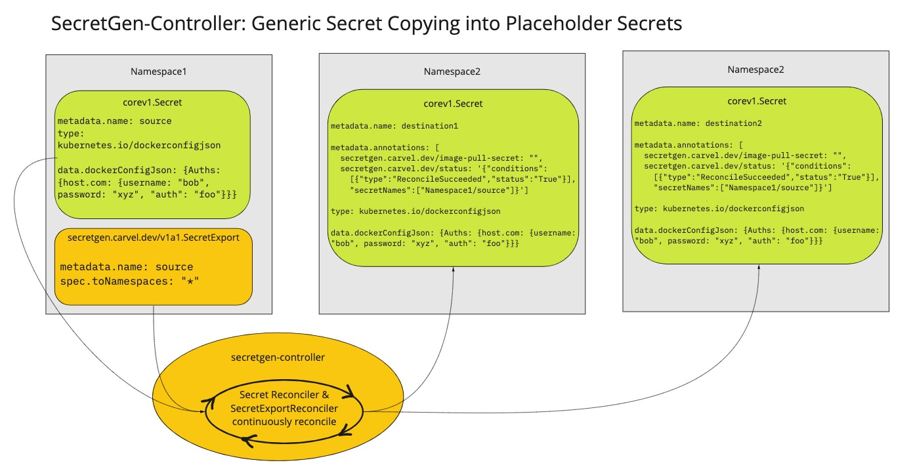
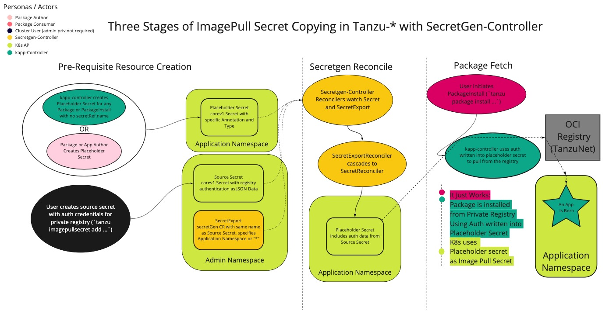

## SecretExport and SecretImport

As of v0.5.0+, SecretExport and SecretImport (prev known as SecretRequest) moved to `secretgen.carvel.dev` API group.

Access to Secret is commonly scoped to its containing namespace (e.g. Pod can only reference Secrets within the same namespace). This constraint is important for maintaining "namespace" boundary.

In some cases an owner of a Secret may want to export it to other namespaces for consumption by other users/programs in the system. Currently there is no builtin way to do this in Kubernetes.

This project introduces two CRDs `SecretExport` and `SecretImport` (and "placeholder secrets") that enable sharing of Secrets across namespaces. SecretExport lets system know that particular Secret is "offered" to be shared with one or more specific namespaces. In the destination namespaces, SecretImport resource lets system know that Secret is allowed to be "copied" into this namespace. By providing a way to express intent of exporting and approving an export, we are able to securely share Secrets between namespaces, without worrying about Secrets getting "stolen" from a different namespace.

Example:

```yaml
apiVersion: v1
kind: Namespace
metadata:
  name: user1
---
apiVersion: v1
kind: Namespace
metadata:
  name: user2
---
apiVersion: v1
kind: Namespace
metadata:
  name: user3
  annotations:
    field.cattle.io/projectId: "cluster1:project1"

#! generate user-password secret upon creation
---
apiVersion: secretgen.k14s.io/v1alpha1
kind: Password
metadata:
  name: user-password
  namespace: user1

#! offer user-password to user2 namespace and namespace with specified annotations (in this case user3)
---
apiVersion: secretgen.carvel.dev/v1alpha1
kind: SecretExport
metadata:
  name: user-password
  namespace: user1
spec:
  toNamespace: user2
  toNamespaceAnnotations:
    field.cattle.io/projectId: 
    - "cluster1:project1"

#! allow user-password to be created in user2 namespace
---
apiVersion: secretgen.carvel.dev/v1alpha1
kind: SecretImport
metadata:
  name: user-password
  namespace: user2
spec:
  fromNamespace: user1

#! allow user-password to be created in namespace user3
---
apiVersion: secretgen.carvel.dev/v1alpha1
kind: SecretImport
metadata:
  name: user-password
  namespace: user3
spec:
  fromNamespace: user1

```

Above configuration results in a `user-password` Secret created within `user2` namespace:

```
Namespace  Name           Kind          Owner    Conds.  Rs  Ri  Age
(cluster)  user1          Namespace     kapp     -       ok  -   1d
^          user2          Namespace     kapp     -       ok  -   1d
user1      user-password  Password      kapp     1/1 t   ok  -   1d
^          user-password  Secret        cluster  -       ok  -   1d
^          user-password  SecretExport  kapp     1/1 t   ok  -   1d
user2      user-password  Secret        cluster  -       ok  -   1d
^          user-password  SecretImport  kapp     1/1 t   ok  -   1d
```

### SecretExport

SecretExport CRD allows to "offer" secrets for export.

`metadata` fields:

- `name`: (required; string) Secret by the same name (in the namespace) will be offered.

`spec` fields:

- `toNamespace` (optional; string) Destination namespace for offer. Use `*` to indicate all namespaces.
- `toNamespaces` (optional; array of strings) List of destination namespaces for offer.
- `toNamespaceAnnotation` (optional; annotation map with single string value) List of destination namespaces annotations key/value for offer.
- `toNamespaceAnnotations` (optional; annotation map with array of strings value) List of destination namespaces annotations key/values for offer.

### SecretImport

SecretImport CRD allows to "accept" secrets being exported.

`metadata` fields:

- `name`: (required; string) Secret by the same name (in the namespace) will be imported; must match SecretExport's name.

`spec` fields:

- `fromNamespace` (optional; string) Source namespace; must be one of SecretExport's destination namespaces.

### Placeholder Secrets

A placeholder secret is:

- a plain Kubernetes Secret
- with `kubernetes.io/dockerconfigjson` type (more about this secret type here)
- has `secretgen.carvel.dev/image-pull-secret` annotation

Their main purpose is to provide an alternative to `SecretImport` to import combination of image pull secrets exported via `SecretExport`. The reason behind offering this feature is to allow configuration (e.g. Helm charts, kapp-controller packages, plain YAMLs) authors to not have to take a hard dependency on secretgen-controller to specify places where image pull secrets could be automatically injected. Instead by using standard Secret resource, such configuration would work in any environment regardless if secretgen-controller is installed or not.

***Warning*** Since SecretExport CR allows you to export registry credentials to other namespaces, they will become visible to users of such namespaces. We strongly recommend to ensure that registry credentials you are exporting only allow read-only access to the registry with minimal necessary scope.

***Exclude From Wildcard Matching***
You can mark a namespace as exempt from wildcard matching (i.e. `*` exports) so
that placeholder secrets in that namespace will only be populated by SecretExports that
explicitly list that namespace in their `toNamespace(s)` field. To mark a
namespace, give it the annotation `secretgen.carvel.dev/excluded-from-wildcard-matching` with any value (e.g. empty string).

Example of a placeholder secret:

```yaml
---
apiVersion: v1
kind: Secret
metadata:
  name: reg-creds
  annotations:
    secretgen.carvel.dev/image-pull-secret: ""
type: kubernetes.io/dockerconfigjson
data:
  .dockerconfigjson: e30K
```

Above secret could be referenced within a Pod, Deployment, ServiceAccount, etc. and would be automatically filled in by secretgen-controller at runtime, making it possible for image fetch to succeed.

The below diagram shows a single secret being exported into two placeholder
secrets.


In products such as [Tanzu Community Edition](https://github.com/vmware-tanzu/community-edition) kapp-controller is used to create placeholder secrets
which are then populated and used as shown in this diagram:

Related documentation on [how to use placeholder secrets can be used with kapp-controller](https://carvel.dev/kapp-controller/docs/latest/private-registry-auth/) in packaging context.

Full example with multiple exported image pull secrets:

```yaml
---
apiVersion: v1
kind: Secret
metadata:
  name: registry-com-creds
  namespace: user1
type: kubernetes.io/dockerconfigjson
stringData:
  .dockerconfigjson: |
    {
      "auths": {
        "registry.com": {"username": ..., "password": ...}
      }
    }
---
apiVersion: secretgen.carvel.dev/v1alpha1
kind: SecretExport
metadata:
  name: registry-com-creds
  namespace: user1
spec:
  toNamespace: user2
---
apiVersion: v1
kind: Secret
metadata:
  name: global-reg-creds
  namespace: user1
type: kubernetes.io/dockerconfigjson
stringData:
  .dockerconfigjson: |
    {
      "auths": {
        "other-registry.com": {"username": ..., "password": ...}
      }
    }
---
apiVersion: secretgen.carvel.dev/v1alpha1
kind: SecretExport
metadata:
  name: global-reg-creds
  namespace: user1
spec:
  # Export to all namespaces
  toNamespace: "*"

# On the importing side
---
apiVersion: v1
kind: Secret
metadata:
  name: my-reg-creds
  namespace: user2
  annotations:
    secretgen.carvel.dev/image-pull-secret: ""
type: kubernetes.io/dockerconfigjson
data:
  .dockerconfigjson: e30K # <-- will be filled with combination of registry-com-creds + global-reg-creds
```
